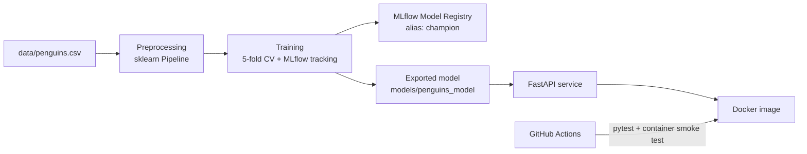

# Penguin Species Classifier — MLOps Pipeline


An end to end MLOps project that predicts a penguin's species from a few body measurements.
The focus of this project is the **engineering around it** —
experiment tracking, model selection and versioning, a validated REST API, containerisation,
automated testing and continuous integration.

## Pipeline overview



## Tech stack

| Area | Tools |
|---|---|
| Modelling | scikit-learn, pandas |
| Experiment tracking & registry | MLflow (SQLite backend) |
| Model serialisation | skops (pickle-free) |
| Serving | FastAPI, Pydantic, Uvicorn |
| Containerisation | Docker |
| Testing | pytest |
| CI | GitHub Actions |

## Results

| Model | CV macro-F1 (5-fold) | Test accuracy |
|---|---|---|
| **Logistic regression** (selected) | 0.9906 ± 0.0115 | 1.000 |
| Random forest | 0.9909 ± 0.0112 | 1.000 |

The random forest scores marginally higher, but the gap (0.0003) is far smaller than the fold-to-fold
variation (~0.011). Under the one-standard-error rule, the simpler logistic regression is selected.

## Key design decisions

- **Preprocessing lives inside the model.** Imputation, scaling and one-hot encoding are part of a single
  sklearn `Pipeline` that is trained, saved and served as one object. The API receives raw measurements
  and never re-implements preprocessing, which prevents training–serving skew. Imputation statistics are
  learned from the training split only, avoiding data leakage.
- **Model selection by cross-validation, not the test set.** Candidates are compared on 5-fold CV of the
  training data; the held-out test set is only used for final confirmation.
- **One-standard-error rule.** The simplest candidate within one standard error of the best CV score wins,
  so noise does not push the pipeline towards unnecessarily complex models.
- **Versioned models with a movable alias.** Each training run registers the best model as a new version
  in the MLflow Model Registry and points the `champion` alias at it, so rolling back means moving an
  alias rather than retraining.
- **Pickle-free serialisation.** Models are saved in the skops format, which only loads explicitly trusted
  types and avoids pickle's arbitrary-code-execution risk.
- **Strict input validation at the API boundary.** Pydantic rejects unknown islands, negative measurements
  and wrong types with a `422` before they reach the model. `sex` is optional because it is often unknown
  in field data, and the pipeline imputes it.
- **Lean, secure serving image.** The Docker image installs only serving dependencies (`mlflow-skinny`
  instead of full MLflow), runs as a non-root user, and orders layers so that dependency installation is
  cached across code changes.
- **Quality gate in CI.** Tests fail if test-set accuracy drops below 0.95. CI also builds the Docker image,
  starts the container and sends a real prediction, which catches missing serving dependencies that unit
  tests alone would not.

## Project structure

```
├── .github/workflows/ci.yml   # CI: tests, then Docker build + smoke test
├── api/main.py                # FastAPI service
├── data/penguins.csv          # Palmer Penguins dataset
├── models/penguins_model/     # Exported production model
├── src/
│   ├── preprocess.py          # Data loading, splitting, preprocessing pipeline
│   ├── model.py               # Model definition, export and loading
│   └── train.py               # Training, CV, MLflow tracking, selection, registration
├── tests/                     # pytest suite (data, model quality, API)
├── Dockerfile
├── requirements.txt           # Serving dependencies (used by Docker)
└── requirements-dev.txt       # + training and testing dependencies
```

## Quickstart

### Run with Docker

```bash
docker build -t penguins-api .
docker run --rm -p 8000:8000 penguins-api
```

Open http://127.0.0.1:8000 for the interactive API docs.

### Run locally

Requires Python 3.12.

```bash
pip install -r requirements-dev.txt
python -m src.train                  # train, track, register and export the best model
uvicorn api.main:app --reload        # start the API
```

View experiments in the MLflow UI:

```bash
mlflow ui --backend-store-uri sqlite:///mlflow.db
```

## API

| Method | Endpoint | Description |
|---|---|---|
| `GET` | `/health` | Service and model status |
| `POST` | `/predict` | Predict species from measurements |

Example request:

```bash
curl -X POST http://127.0.0.1:8000/predict \
  -H "Content-Type: application/json" \
  -d '{"bill_length_mm": 39.1, "bill_depth_mm": 18.7, "flipper_length_mm": 181,
       "body_mass_g": 3750, "island": "Torgersen", "sex": "male"}'
```

Example response:

```json
{
  "species": "Adelie",
  "probabilities": {"Adelie": 0.999, "Chinstrap": 0.001, "Gentoo": 0.0}
}
```

## Testing

```bash
pytest -v
```

The suite covers data loading, predictions on known specimens from each species, a minimum accuracy
threshold, the model-missing error path, and API behaviour for valid, partial and invalid requests.

## Future improvements

- Hyperparameter search logged as nested MLflow runs
- Data validation (e.g. schema and range checks) before training
- Publish the image to a container registry from CI and deploy to a cloud platform
- Prediction logging and drift monitoring in production

## Data

[Palmer Penguins](https://allisonhorst.github.io/palmerpenguins/) by Allison Horst, Alison Hill and
Kristen Gorman. Data collected by Dr. Kristen Gorman and the Palmer Station Long Term Ecological Research
Program. Released under CC0.